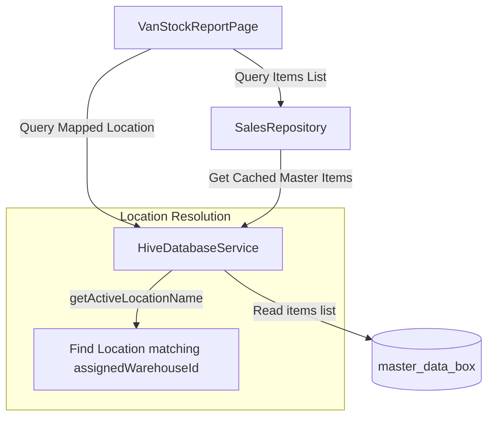

# Modification Design: Add Van Stock Report

This design document outlines the architecture, layout, and implementation details for adding a new **Van Stock Report** to the Flutter van sales management application.

---

## 1. Overview

The goal of this modification is to introduce a dedicated **Van Stock Report** page that displays the real-time stock levels of inventory items currently loaded in the delivery van. The van's stock is scoped to the user's mapped Zoho Books Location (active location).

This page will be accessible from the **Reports** section of the Dashboard.

---

## 2. Detailed Analysis of the Goal

### Current State
* The application manages data synchronization with Zoho Books using the **Locations** module (`GET /locations`).
* The active location's ID is stored locally in Hive as `assigned_warehouse_id`.
* Inventory items and their stock levels (specific to the assigned location) are fetched and cached locally in Hive (`master_data_box`) under the `items` key.
* The Dashboard has an **Analytics & Reports** tab displaying three reports: "Item Sales Report", "Customer Ledger", and "Agewise Receivables". There is no report displaying the current inventory stock loaded on the van.

### Proposed State
* Add a new entry point **Van Stock Report** in the `AnalyticsReportsTab` list.
* Create a **`VanStockReportPage`** that:
  1. Resolves the active location name from the cached locations list matching the session's active location ID.
  2. Displays the resolved location name in the header/appbar context.
  3. Displays a searchable list of all inventory items and their stock quantities.
  4. Each item is rendered using a `ListTile` showing:
     * Item Name
     * SKU / Item Code (subtitle)
     * Standard Rate (formatted with the organization's currency symbol)
     * Available Stock (formatted with units if applicable, highlighting low/zero stock).

---

## 3. Alternatives Considered

### Alternative A: Live Network Fetch on Load
* **Description:** Query Zoho Books `/items?location_id=...` directly over the network whenever the Stock Report page is opened.
* **Pros:** Guarantees absolute real-time accuracy from the Zoho server.
* **Cons:** Violates the **offline-first design** of the application. If the agent is on-route with poor internet connectivity, the stock report will fail to load or be extremely slow. It would also hit Zoho API rate limits.
* **Decision:** **Rejected.** We will read from the locally cached `master_data_box` using `SalesRepository.getItems()`, which is updated during master data synchronizations.

### Alternative B: Direct GetIt Dependency Injection in UI
* **Description:** Resolve `HiveDatabaseService` and query items/locations directly inside the widget code.
* **Pros:** Less boilerplate.
* **Cons:** Violates the clean architecture rule of the project. The UI layer should depend on domain-level repositories rather than raw data services.
* **Decision:** **Rejected.** We will access the data using the `SalesRepository` and resolve the active location context gracefully.

---

## 4. Detailed Design

### 4.1 UI Layout & Interaction
* **Entry Point:** A new `_ReportTile` on `AnalyticsReportsTab` titled **"Van Stock Report"** with a subtitle `"Current inventory quantities loaded in the active van."` and an inventory icon (e.g., `Icons.inventory_2_rounded`).
* **Header/AppBar:** Displays the title `"Van Stock Report"` with a subtitle indicating the active location name (e.g. `Location: 78352-HASHIM AL QUISIS (Warehouse)`).
* **Search Filtering:** A search `TextField` at the top of the list allowing case-insensitive filtering by Item Name or SKU.
* **List View:** Lazy-loaded using `ListView.builder` for large catalog performance.
* **List Item Card:**
  * **Title:** Bold item name.
  * **Subtitle:** SKU/Item Code + formatted unit rate (e.g., `SKU: BRED-WHEAT | Rate: AED 4.50`).
  * **Trailing:** A stock badge (pill) showing the quantity (e.g. `5 units` or `0 units`). Zero stock will render in red/warning colors, while positive stock will render in green/indigo accents.

### 4.2 Data & Architecture Flow



### 4.3 Code Structure changes

#### 1. `lib/ui/features/reports/views/van_stock_report_page.dart` (New File)
A stateful widget that loads items and the active location upon initiation. It implements a local search controller and updates the filtered list dynamically.
* Uses `context.org` (via `org_context_extension.dart`) to format currency rates.
* Resolves the active location name:
  ```dart
  final dbService = sl<HiveDatabaseService>();
  final activeId = dbService.assignedWarehouseId;
  final locations = dbService.getWarehouses(); // locations are stored as Warehouses
  final activeLocationName = locations.firstWhere((l) => l.id == activeId, orElse: () => Warehouse(id: activeId ?? '', name: 'Active Location', address: '')).name;
  ```

#### 2. `lib/ui/features/dashboard/widgets/analytics_reports_tab.dart`
* Add `onStockReport` callback parameter to the widget.
* Insert a new `_ReportTile` in the ListView pointing to `onStockReport`.

#### 3. `lib/ui/features/dashboard/views/dashboard_page.dart`
* Add `_showStockReport()` method:
  ```dart
  void _showStockReport() {
    Navigator.push(
      context,
      MaterialPageRoute(builder: (_) => const VanStockReportPage()),
    );
  }
  ```
* Inject the callback `onStockReport: _showStockReport` in the `AnalyticsReportsTab` initialization block.

---

## 5. Summary of the Design

The Van Stock Report will be implemented as a clean, offline-first report screen loaded directly from the local Hive master data store. It displays items, rates, and active van stock levels in ListTiles, scoped to the current user's active Location. Performance is optimized using `ListView.builder` and search input filtering.

---

## 6. References
* [Flutter ListView Search Filtering Best Practices](https://www.google.com/search?q=flutter+listview+search+filter+best+practices)
* Clean Architecture guidelines in `CLAUDE.md`.
