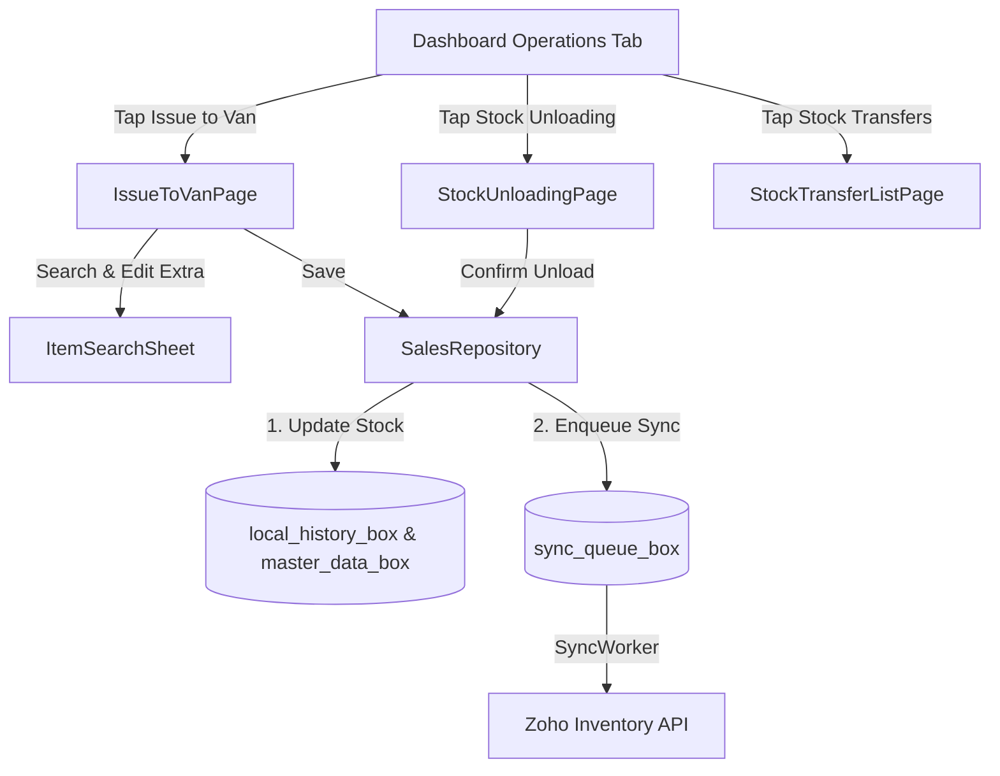

# Modification Design: Stock Transfer Features (Issue to Van & Stock Unloading)

This design document outlines the architecture, data models, persistence mechanism, API integration, and user interface for implementing two new Stock Transfer features: **Issue to Van** and **Stock Unloading**.

---

## 1. Overview

The goal of this modification is to enable on-route sales agents to log and synchronize stock movements between the main Warehouse and their active Location (Van). Both operations are stored as **Stock Transfers** (mapped to Zoho Inventory **Transfer Orders**):

1. **Issue to Van (Replenishment)**: Moves stock from the main warehouse (Default Warehouse in Zoho Books) to the current Location (Van).
2. **Stock Unloading (End of Session)**: Moves the remaining balance stock in the Van back to the main warehouse.

---

## 2. Detailed Analysis of the Goal

### 2.1 Mappings & Constraints
* **Current Location (Van)**: Determined at login and stored locally in Hive (`assigned_warehouse_id`).
* **Default Warehouse**: Identified by finding the synced warehouse record with `isPrimary == true` (default warehouse). As resolved from the live Zoho Books API, the primary warehouse is:
  * **Name**: `Koyson General Trading LLC`
  * **ID**: `3331482000000095023`
* **Stock Transfer Directions**:
  * **Issue to Van**: `From Location` = Default Warehouse (`3331482000000095023`), `To Location` = Current Location (Van).
  * **Stock Unloading**: `From Location` = Current Location (Van), `To Location` = Default Warehouse (`3331482000000095023`).

### 2.2 Column Structure for "Issue to Van"
To help the agent calculate replenishment quantities, the item editor must present a grid showing:
1. **Current Stock (Col 1)**: Current quantity available in the Van.
2. **Invoice Summary (Col 2)**: Total quantity of the item sold in invoices created on the selected date for the active Location.
3. **Total (Col 3)**: Sum of Current Stock + Invoice Summary (`Col 1 + Col 2`).
4. **Extra Load (Col 4)**: User-entered additional replenishment quantity.
5. **Grand Total (Col 5)**: Sum of Total + Extra (`Col 3 + Col 4 = Col 1 + Col 2 + Col 4`).

* **Transferred Quantity**: The actual physical quantity moved from the warehouse to the van is the replenishment amount: `Col 2 (Invoice Qty) + Col 4 (Extra Qty)`.
* **New Item Addition**: The user must be allowed to search and add new items. Added items start with `Col 1 = 0`, `Col 2 = 0`, and the user enters the quantity into `Col 4 (Extra)`.

### 2.3 Stock Unloading Behavior
* Transfers the complete remaining balance stock (`Current Stock`) in the Van back to the Warehouse.
* Quantities are non-editable (they correspond to whatever is currently stocked in the van).
* Once saved, the local stock level of the unloaded items in the van is reset to `0`.

### 2.4 Offline-First & Persistence
* All transfers are logged locally as `StockTransfer` objects, saved in Hive (`local_history_box`), and enqueued as `SyncQueueItem` (type: `stock_transfer`) for background sync.
* Stock levels of the local items in Hive are updated **immediately** upon saving the transfer locally to maintain inventory consistency offline:
  * **Issue to Van**: Local item stock increases by `Col 2 (Invoice Qty) + Col 4 (Extra Qty)`.
  * **Stock Unloading**: Local item stock decreases by the unloaded quantity (becoming `0`).

---

## 3. Alternatives Considered

### Alternative A: Do not update local stock until Zoho sync completes
* **Pros**: Prevents local/remote inventory mismatches if the Zoho API rejects a transfer order.
* **Cons**: Breaks the offline invoice creation feature. If an agent loads stock (Issue to Van) while offline and immediately goes to sell it, the app would block invoice creation because the local stock would still read `0`.
* **Decision**: **Rejected.** We must update local stock levels immediately to support subsequent offline billing.

---

## 4. Detailed Design

### 4.1 Data Models

#### 1. Domain Model: `StockTransfer`
Created in `lib/domain/models/stock_transfer.dart`:
```dart
import 'package:equatable/equatable.dart';
import 'item.dart';

class StockTransferLineItem extends Equatable {
  final Item item;
  final int currentStock;
  final int invoiceQty;
  final int extraQty;
  final int transferQty; // Issue to Van = invoiceQty + extraQty, Unloading = currentStock

  const StockTransferLineItem({
    required this.item,
    required this.currentStock,
    required this.invoiceQty,
    required this.extraQty,
    required this.transferQty,
  });

  @override
  List<Object?> get props => [item, currentStock, invoiceQty, extraQty, transferQty];
}

class StockTransfer extends Equatable {
  final String id;
  final String transferNumber;
  final String fromWarehouseId;
  final String fromWarehouseName;
  final String toWarehouseId;
  final String toWarehouseName;
  final DateTime date;
  final List<StockTransferLineItem> items;
  final String notes;
  final bool isPendingSync;
  final String type; // 'issue_to_van' | 'stock_unloading'

  const StockTransfer({
    required this.id,
    required this.transferNumber,
    required this.fromWarehouseId,
    required this.fromWarehouseName,
    required this.toWarehouseId,
    required this.toWarehouseName,
    required this.date,
    required this.items,
    required this.notes,
    this.isPendingSync = false,
    required this.type,
  });

  StockTransfer copyWith({
    String? id,
    String? transferNumber,
    String? fromWarehouseId,
    String? fromWarehouseName,
    String? toWarehouseId,
    String? toWarehouseName,
    DateTime? date,
    List<StockTransferLineItem>? items,
    String? notes,
    bool? isPendingSync,
    String? type,
  }) {
    return StockTransfer(
      id: id ?? this.id,
      transferNumber: transferNumber ?? this.transferNumber,
      fromWarehouseId: fromWarehouseId ?? this.fromWarehouseId,
      fromWarehouseName: fromWarehouseName ?? this.fromWarehouseName,
      toWarehouseId: toWarehouseId ?? this.toWarehouseId,
      toWarehouseName: toWarehouseName ?? this.toWarehouseName,
      date: date ?? this.date,
      items: items ?? this.items,
      notes: notes ?? this.notes,
      isPendingSync: isPendingSync ?? this.isPendingSync,
      type: type ?? this.type,
    );
  }

  @override
  List<Object?> get props => [
        id,
        transferNumber,
        fromWarehouseId,
        fromWarehouseName,
        toWarehouseId,
        toWarehouseName,
        date,
        items,
        notes,
        isPendingSync,
        type,
      ];
}
```

#### 2. Data Model: `StockTransferModel`
Created in `lib/data/models/stock_transfer_model.dart` to map the JSON payload to the Zoho Books/Inventory API schema:
* Endpoint: `POST https://www.zohoapis.com/inventory/v1/transferorders`
* Payload structure:
```json
{
  "transfer_order_number": "TO-TEMP-172...",
  "date": "2026-07-06",
  "from_warehouse_id": "source_wh_id",
  "to_warehouse_id": "dest_wh_id",
  "reason": "Issue to Van / Stock Unloading",
  "line_items": [
    {
      "item_id": "item_id",
      "quantity_transfer": 15
    }
  ]
}
```

---

### 4.2 Storage & Repository Layer

#### 1. `HiveDatabaseService` Extensions
Add storage utilities in `lib/data/services/hive_database_service.dart` to save stock transfers and adjust local item stocks:
```dart
List<StockTransfer> getLocalStockTransfers() {
  final rawList = _localHistoryBox.get('stock_transfers', defaultValue: []);
  return (rawList as List)
      .map((item) => StockTransferModel.fromJson(Map<String, dynamic>.from(jsonDecode(item))))
      .toList();
}

Future<void> saveLocalStockTransfer(StockTransfer transfer) async {
  final current = getLocalStockTransfers();
  final index = current.indexWhere((t) => t.id == transfer.id);
  final oldTransfer = index >= 0 ? current[index] : null;

  final localItems = getItems();

  // Reverse old quantities to prevent double-counting
  if (oldTransfer != null) {
    for (final line in oldTransfer.items) {
      final idx = localItems.indexWhere((it) => it.id == line.item.id);
      if (idx >= 0) {
        final existing = localItems[idx];
        if (oldTransfer.type == 'issue_to_van') {
          localItems[idx] = existing.copyWith(stock: existing.stock - line.transferQty);
        } else if (oldTransfer.type == 'stock_unloading') {
          localItems[idx] = existing.copyWith(stock: existing.stock + line.transferQty);
        }
      }
    }
  }

  // Apply new quantities
  for (final line in transfer.items) {
    final idx = localItems.indexWhere((it) => it.id == line.item.id);
    if (idx >= 0) {
      final existing = localItems[idx];
      if (transfer.type == 'issue_to_van') {
        localItems[idx] = existing.copyWith(stock: existing.stock + line.transferQty);
      } else if (transfer.type == 'stock_unloading') {
        final remaining = deductStock(
          itemId: line.item.id,
          itemName: line.item.name,
          available: existing.stock,
          requested: line.transferQty,
        );
        localItems[idx] = existing.copyWith(stock: remaining);
      }
    }
  }

  await saveItems(localItems);

  if (index >= 0) {
    current[index] = transfer;
  } else {
    current.add(transfer);
  }

  final serialized = current
      .map((t) => jsonEncode(StockTransferModel.fromDomain(t).toJson()))
      .toList();
  await _localHistoryBox.put('stock_transfers', serialized);
}
```

#### 2. `SalesRepository` Extensions
Declare and implement `getLocalStockTransfers()` and `saveLocalStockTransfer()` on the repository layer.

---

### 4.3 API Client & Sync SyncWorker

#### 1. `ZohoApiClient.syncStockTransfer`
```dart
Future<String> syncStockTransfer(Map<String, dynamic> transferJson) async {
  if (!_isMockMode() && !_mockTransactions) {
    try {
      final response = await _dio.post(
        'https://www.zohoapis.com/inventory/v1/transferorders', 
        data: transferJson,
      );
      if (response.statusCode == 201 || response.statusCode == 200) {
        return response.data['transfer_order']['transfer_order_id'];
      }
    } catch (e) {
      throw Exception('Zoho Inventory Stock Transfer Sync Failed: $e');
    }
  }
  await Future.delayed(const Duration(seconds: 1));
  return 'zoho_to_${DateTime.now().millisecondsSinceEpoch}';
}
```

#### 2. `SyncWorker` Integration
In `lib/data/services/sync_worker.dart`, add a case to dispatch `'stock_transfer'`:
```dart
case 'stock_transfer':
  remoteId = await _apiClient.syncStockTransfer(item.payload);
  break;
```

---

### 4.4 State Management (BLoC)
Create `StockTransferBloc` in `lib/ui/features/stock_transfer/bloc/stock_transfer_bloc.dart`:
* **Events**:
  * `LoadStockTransfers`: Fetches the history list.
  * `StartIssueToVan`: Initializes issue form with default warehouse, active location, and todays' invoice stock counts.
  * `StartStockUnloading`: Initializes unloading form with active location and non-zero stock items.
  * `UpdateLineExtraQty`: Updates column 4 (extra quantity) of a line item.
  * `AddLineItem`: Search and append new items into Column 4.
  * `SaveStockTransfer`: Computes the transfer quantity payload, registers it locally, enqueues the sync queue item, and redirects back.
* **State**:
  * `List<StockTransfer> transfers`
  * `String? fromWarehouseId`, `String? toWarehouseId`
  * `List<StockTransferLineItem> editingItems`
  * `bool isLoading`, `String? successMessage`, `String? errorMessage`

---

### 4.5 User Interface Mockup & Navigation Flow



#### Screen Details
1. **IssueToVanPage**:
   * Displays Warehouse Names.
   * Renders a layout presenting Column 1-5 for each item.
   * Tap row to trigger a quantity selector to edit **Extra Qty** (Column 4).
   * Floating "Add Item" button using `ItemSearchSheet`.
   * Save button which triggers BLoC validation and saves the transfer.

2. **StockUnloadingPage**:
   * Shows Van -> Warehouse directions.
   * Table displaying items with non-zero stock.
   * "Confirm Unload" button that clears the van stock levels.

3. **StockTransferListPage**:
   * Lists historical logs. Displays badges (`Issue to Van` vs `Unloading`) and sync states (`Completed` vs `Pending`).

---

## 5. References
* Zoho Inventory API: [Transfer Orders Reference Documentation](https://www.zoho.com/inventory/api/v1/#transfer-orders)
* Local storage: [hive_database_service.dart](file:///E:/work/nellon/lib/data/services/hive_database_service.dart)
* Project guidelines: [CLAUDE.md](file:///E:/work/nellon/CLAUDE.md)
