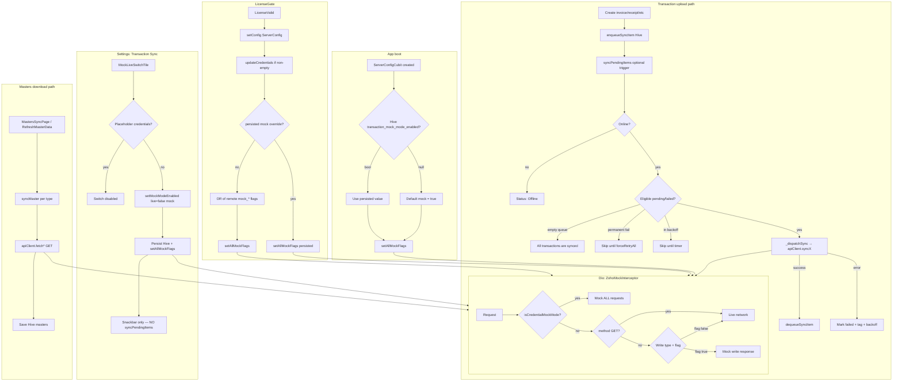
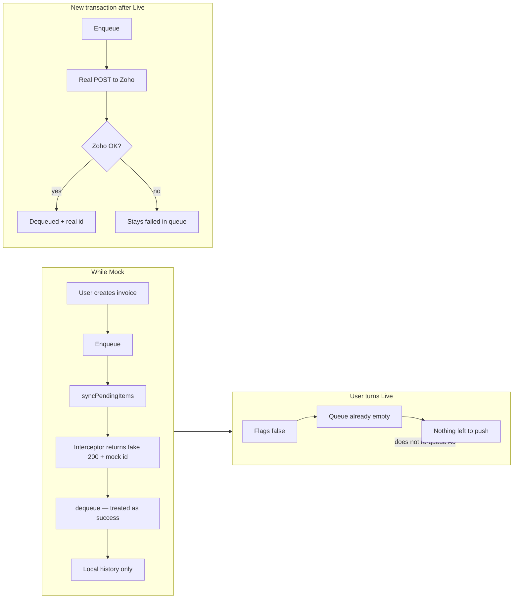

# Why "Live Mode" Does Not Mean Data Syncs to Zoho

> **Historical.** The in-app mock/live switch, `ZohoMockInterceptor`, and mock flags have been removed. All Zoho HTTP is live. Keep this file only as a record of why queued items may still fail to upload (OAuth, classification, retry UI).

## Scope
Code-only diagnosis of mock/live mode vs sync. No docs read.

## Short answer
**"Transaction Sync → Live" only flips write-mock flags.** It does **not** re-queue already mock-synced items, does **not** download masters, and does **not** immediately run the upload worker. Sync is a separate offline queue pipeline that may already be empty, blocked, or failing for other reasons.

---

## Two completely different "sync" paths

| Path | What it moves | Controlled by Live switch? |
|------|---------------|----------------------------|
| **Masters download** (`SyncWorker.syncMaster` / `refreshMasterData`) | Org, items, customers, taxes, etc. **GET** from Zoho → Hive | **No.** With real credentials, GETs never hit the mock interceptor. |
| **Transaction upload** (`SyncWorker.syncPendingItems`) | Offline queue (invoice, receipt, SO, …) **POST/PUT** → Zoho | **Yes.** Live = flags false → writes go to network. |

The Settings tile is titled **"Transaction Sync"** and only calls `ServerConfigCubit.setMockModeEnabled`.

---

## How Live / Mock is applied

1. **Boot** (`ServerConfigCubit` constructor):
   - Read Hive `transaction_mock_mode_enabled`
   - If null → **default mock = true**
   - `apiClient.setAllMockFlags(enabled)` (all three flags same value)

2. **License valid** (`LicenseGate` → `setConfig`):
   - Injects Zoho credentials from remote `ServerConfig`
   - Mock again: **persisted Hive override wins**; else OR of remote `mock_transactions` / `mock_sales_order_transactions` / `mock_stock_transfers` (defaults: true / false / true → overall mock)

3. **User flips switch** (`MockLiveSwitchTile`):
   - Live → `setMockModeEnabled(false)` → persist false + `setAllMockFlags(false)`
   - Mock → `setMockModeEnabled(true)` → all true
   - **Does not call `syncPendingItems()`**

4. **Transport** (`ZohoMockInterceptor.shouldMockRequest`):
   - Placeholder credentials (`YOUR_CLIENT_ID` / empty) → **mock everything**
   - Real credentials + **GET** → **always live**
   - Real credentials + write → mock only if the matching flag is true

Hardcoded client credentials in `ZohoApiClient` are not placeholders, so the switch is not credential-locked unless remote config left empties and prior state is weird. Switch disabled only when `usesPlaceholderCredentials` is true.

---

## Why the app can look like it "is not syncing" after Live

### 1. Queue already emptied under mock (most likely for prior work)
When mock flags are on, writes still "succeed" via interceptor. `SyncWorker` then **dequeues** the item as completed.

Those transactions are **gone from the queue**. Switching to Live does **not** recreate them or push local history to Zoho. UI can honestly say "All transactions are synced" while Zoho has nothing.

### 2. Live toggle does not trigger a sync sweep
`setMockModeEnabled` only updates Hive + flags + cubit state.

Upload only starts when:
- Connectivity changes to online
- 60s auto-retry timer fires
- A feature creates a transaction and calls `syncPendingItems()`
- User manually triggers via Sync UI (`TriggerSync`)

### 3. Failed items may never auto-retry
In `syncPendingItems` (without `forceRetryAll`):
- Errors tagged `[Needs Attention]` (permanent) → **skipped forever** until manual "Retry Failed"
- Transient errors → exponential backoff (30s … 30m)
- Offline → early return

So Live + full queue of permanent failures still looks like "not syncing".

### 4. Masters are not the Live switch
If "syncing data" means items/customers refresh: that is Masters Sync page / `refreshMasterData`, independent of the Live tile. Failures there are OAuth/network/API, not mock flags (with real credentials).

### 5. New Live writes can still fail on the live path
With flags false, POST hits Zoho for real. Auth refresh, org id, validation, scopes (e.g. Inventory for stock transfer) can fail → item marked failed with tagged error. Not silent mock success.

### 6. UI "Live" is all-or-nothing after toggle
`setAllMockFlags` sets all three flags together. Remote defaults differ per type, but the switch forces all on or all off. Cubit `isMockModeEnabled` tracks that unified preference. (`ZohoApiClient.isMockModeEnabled` uses AND of three flags; after `setAllMockFlags` they stay consistent.)

---

## Mermaid: overall mock/live + sync architecture



## Mermaid: what happens when user turns Live

```mermaid
sequenceDiagram
  participant User
  participant Tile as MockLiveSwitchTile
  participant Cubit as ServerConfigCubit
  participant Hive as HiveDatabaseService
  participant API as ZohoApiClient
  participant Worker as SyncWorker
  participant Zoho as Zoho Books

  User->>Tile: Turn Transaction Sync ON (Live)
  Tile->>Cubit: setMockModeEnabled(false)
  Cubit->>Hive: put transaction_mock_mode_enabled = false
  Cubit->>API: setAllMockFlags(false)
  Note over API: _mockTransactions = false<br/>_mockSalesOrderTransactions = false<br/>_mockStockTransfers = false
  Cubit-->>Tile: emit isMockModeEnabled: false
  Tile-->>User: "Live mode — transactions will push to Zoho"
  Note over Worker: No call here

  Note over Worker,Zoho: Later (timer / connectivity / new txn / manual Retry)
  Worker->>Worker: syncPendingItems()
  alt Queue empty (already mock-dequeued)
    Worker-->>User: "All transactions are synced"
  else Pending items
    Worker->>API: syncInvoice / syncCustomer / ...
    API->>API: ZohoMockInterceptor: GET never mock; writes flags false
    API->>Zoho: Real POST/PUT + OAuth
    alt Success
      Worker->>Hive: dequeue item
    else Failure
      Worker->>Hive: status failed + [Retryable]/[Needs Attention]
    end
  end
```

## Mermaid: mock success vs live (why old data never appears in Zoho)



---

## Code anchors

| Concern | Location |
|---------|----------|
| Live switch | `lib/ui/features/licensing/widgets/mock_live_switch_tile.dart` |
| Persist + flags | `lib/ui/features/licensing/cubit/server_config_cubit.dart` |
| License injects config | `lib/ui/features/licensing/views/license_gate.dart` |
| Default mock flags on model | `lib/domain/models/server_config.dart` |
| Mock interceptor routing | `lib/data/services/zoho_mock/zoho_mock_interceptor.dart` |
| Credential mock + flags | `lib/data/services/zoho_api_client.dart` |
| Queue process / dequeue / backoff | `lib/data/services/sync_worker.dart` |
| Masters vs queue UI | `lib/ui/features/sync/views/masters_sync_page.dart` |

---

## Practical checks on device

1. Sync Queue tab: empty vs pending vs `[Needs Attention]` / `[Retryable]`.
2. After Live: create a **new** invoice and watch queue + Zoho (old mock-completed rows will not appear).
3. Permanent failures: use **Retry Failed** (`forceRetryAll: true`).
4. Masters: pull separately on Sync Masters; not gated by the Live tile.
5. If writes fail live: status text / item error for OAuth or validation (not mock short-circuit).

---

## Optional fixes (only if you want code changes later)

1. After `setMockModeEnabled(false)`, call `syncPendingItems(forceRetryAll: true)`.
2. When mock→live, warn that previously mock-synced docs will not re-upload; optional "re-queue from local history".
3. Do not dequeue (or mark `syncedViaMock`) so Live can re-drive the same queue.
4. Clarify UI: "Transaction uploads (not master data)".
5. Align remote defaults / `isMockModeEnabled` semantics if partial flags return.

This analysis is explanatory only; no code changes proposed as required next step unless you ask to implement a fix.
