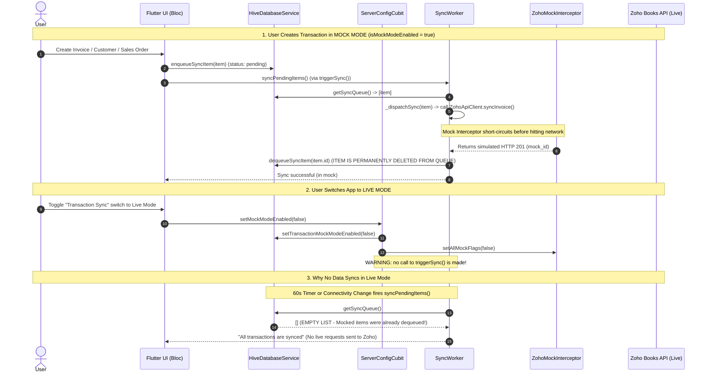

# Root Cause Analysis & Plan: Why the App Does Not Sync Data After Turning to Live Mode

> **Historical.** The in-app mock/live switch and `ZohoMockInterceptor` have been removed. All Zoho HTTP is live. Queue/OAuth notes below may still apply.

## Goal Description
This document provides a comprehensive root-cause analysis deduced directly from the codebase explaining why transactions created while the app is in **Mock Mode** do not sync to Zoho Books after switching the app to **Live Mode**. It includes a complete **Mermaid workflow diagram** tracing the lifecycle of a transaction through the local queue, mock interceptor, and sync worker, as well as concrete architectural proposals to fix this behavior.

---

## Root Cause Analysis (Deduced from Code)

There are **three interacting architectural mechanisms** responsible for why data does not sync after turning to Live mode:

### 1. Simulated Uploads Permanently Dequeue Items in Mock Mode
- **Queueing (`sales_invoice_bloc.dart` / `sales_repository_impl.dart`)**:
  When a user creates a transaction (e.g., an Invoice, Sales Order, Customer, Receipt), the application adds a `SyncQueueItem` to the local Hive database via `_dbService.enqueueSyncItem(item)` and immediately calls `_syncRepository.triggerSync()`.
- **Mock Interception (`zoho_mock_interceptor.dart`)**:
  In `ZohoApiClient`, `ZohoMockInterceptor` is added as the very first Dio interceptor (`_dio.interceptors.add(mockInterceptor)`). When `_mockTransactions == true` (which is the default on app boot via `ServerConfigCubit._bootstrapMockMode`), `shouldMockRequest(options)` returns `true` for all transaction `POST`/`PUT` requests.
- **Permanent Dequeue (`sync_worker.dart`, lines 251–255)**:
  ```dart
  await _dispatchSync(item); // Short-circuited by ZohoMockInterceptor -> returns HTTP 201

  // Mark completed and remove from queue
  await _dbService.dequeueSyncItem(item.id);
  successCount++;
  break;
  ```
  Because `ZohoMockInterceptor` returns a simulated `201 Created` / `200 OK` response, `SyncWorker` treats the mock upload as a genuine server success and **deletes the transaction from the offline sync queue (`_dbService.dequeueSyncItem(item.id)`)**.
- **Result upon switching to Live Mode**:
  When the user later turns on Live Mode, **the sync queue (`_dbService.getSyncQueue()`) is already EMPTY** for all historical transactions created while in Mock Mode. They were already consumed and dequeued by the mock simulator.

### 2. Toggling to Live Mode Does Not Initiate a Sync Attempt
- **UI Switch (`mock_live_switch_tile.dart`, lines 40–53)**:
  Toggling the switch calls `context.read<ServerConfigCubit>().setMockModeEnabled(!live)`.
- **Cubit Logic (`server_config_cubit.dart`, lines 90–115)**:
  ```dart
  Future<void> setMockModeEnabled(bool enabled) async {
    await _dbService.setTransactionMockModeEnabled(enabled);
    _apiClient.setAllMockFlags(enabled);
    ...
  }
  ```
  The method updates Hive preferences and flips `_apiClient.setAllMockFlags(false)`. **It never calls `_syncRepository.triggerSync()` or `_syncWorker.syncPendingItems()`**.
- Even if there *were* unsynced items remaining in the queue, switching from Mock to Live mode does not trigger an immediate synchronization run.

### 3. Exponential Backoff & Permanent Error Filters Block Automatic Retries
- If any items remain in the queue with status `SyncStatus.failed`, automatic sync triggers (such as the 60-second periodic timer `_autoRetryTimer` or `Connectivity().onConnectivityChanged`) call `syncPendingItems(forceRetryAll: false)`.
- In `SyncWorker.syncPendingItems` (`sync_worker.dart`, lines 195–205):
  ```dart
  final isPermanent = item.errorMessage?.startsWith('[Needs Attention]') ?? false;
  if (isPermanent) return false;
  final nextRetryAt = item.timestamp.add(_backoffDelay(item.retryCount));
  return !now.isBefore(nextRetryAt);
  ```
  - **Permanent errors** (tagged `[Needs Attention]`) are **never retried** automatically.
  - **Transient errors** are skipped if their exponential backoff delay (30s, 1m, 2m, 4m, 8m... up to 30 minutes) has not elapsed.

---

## Mermaid Workflow: What is Happening



---

## User Review Required

> [!IMPORTANT]
> **Architectural Decision on Mock vs. Live Transactions**:
> Should transactions created while in **Mock Mode** be considered **disposable sandbox simulations** (the current design, where they are consumed and dequeued without touching Zoho), OR should switching to Live mode **re-enqueue local historical transactions** that have never been pushed to Zoho Books?

---

## Open Questions

1. **Option A (Strict Sandbox Mode - Recommended if Mock is for Training/Testing)**:
   Do you want Mock Mode transactions to remain isolated sandbox data, but make the UI explicitly warn the user that *"Transactions created in Mock Mode are simulations and will not be uploaded to Zoho Books when switching to Live Mode"*?
2. **Option B (Automatic Re-enqueue on Live Switch - Recommended if Mock is an Offline Staging Mode)**:
   Should toggling from Mock Mode to Live Mode automatically scan local storage (`getLocalInvoices()`, `getLocalOrders()`, etc.), find records whose IDs are mock/temporary IDs, re-enqueue them into `HiveDatabaseService.getSyncQueue()`, and trigger an immediate sync (`triggerSync(forceRetryAll: true)`)?

---

## Proposed Changes (For Option B: Auto Re-enqueue & Immediate Sync)

If Option B is selected, we propose modifying the following components:

### Licensing Area (`lib/ui/features/licensing/cubit/`)

#### [MODIFY] `server_config_cubit.dart`
- Inject `SyncRepository` into `ServerConfigCubit`.
- Upon `setMockModeEnabled(false)`, trigger `_syncRepository.triggerSync(forceRetryAll: true)`.

```diff
  Future<void> setMockModeEnabled(bool enabled) async {
    await _dbService.setTransactionMockModeEnabled(enabled);
    _apiClient.setAllMockFlags(enabled);
+   if (!enabled && _syncRepository != null) {
+     unawaited(_syncRepository.triggerSync(forceRetryAll: true));
+   }
    ...
```

### Sync Engine (`lib/data/services/`)

#### [MODIFY] `sync_worker.dart`
- Add a helper method `requeueUnsyncedLocalTransactions()` that scans local box records (`getLocalInvoices()`, `getLocalOrders()`, etc.), identifies any record with a temporary or mock Zoho ID, and pushes a fresh `SyncQueueItem` back into `HiveDatabaseService` before executing `syncPendingItems(forceRetryAll: true)`.

---

## Verification Plan

### Automated Tests
- Run existing unit/integration tests to ensure no regressions in sync queue processing:
  ```bash
  flutter test
  ```
- Add unit test in `server_config_cubit_test.dart` verifying that `setMockModeEnabled(false)` invokes sync trigger when transitioning to Live mode.

### Manual Verification
1. Open the app in **Mock Mode** and create a test Invoice.
2. Verify in UI that the invoice is marked as synced (mocked).
3. Switch the toggle in the drawer/licensing page from **Mock Mode** to **Live Mode**.
4. Verify that the app immediately initiates a sync attempt and/or informs the user of the sync queue status.
