# Fix: "Live mode" doesn't sync

> **Historical.** The mock/live toggle (`setMockModeEnabled`, `MockLiveSwitchTile`, `ZohoMockInterceptor`) has been removed. All Zoho HTTP is live. Auth-classification and retry-UI notes below may still apply to the live queue.

## Context

APK was built and installed. After flipping **Transaction Sync** to Live in the dashboard drawer, nothing syncs. Traced through the code, this is not one bug — it's a chain of four independent defects that each break the live path, plus a UI dead-end that makes recovery impossible without reinstalling.

The critical one: **an OAuth failure is misclassified as a permanent/validation error**, which tags the queue item `[Needs Attention]` and permanently excludes it from every future automatic sync sweep. The only escape hatch (`forceRetryAll`) exists in the repository, the bloc, and the event class — but **has no caller anywhere in the app**.

---

## Root causes (all verified in code)

### 1. Flipping the toggle triggers no sync at all
`ServerConfigCubit.setMockModeEnabled` (`lib/ui/features/licensing/cubit/server_config_cubit.dart:90-115`) writes one Hive boolean, calls `setAllMockFlags`, re-emits state. It never calls `triggerSync()`. After flipping to Live the user waits on the 60s timer (`sync_worker.dart:140-143`), a connectivity transition, or a brand-new transaction.

### 2. Auth failures are classified `permanent` → item locked out forever
The auth interceptor rejects with a `DioException` that **omits `type`** (`zoho_api_client.dart:161-167`), so it defaults to `DioExceptionType.unknown`. `classifySyncError` (`error_classification.dart:35-38`) maps `unknown` → `ErrorCategory.permanent` → tagged `[Needs Attention]` (`sync_worker.dart:282-284`) → skipped by `sync_worker.dart:200-202` on every subsequent automatic sweep. A recoverable credential/network problem becomes a permanent dead item.

### 3. No "Retry Failed" UI exists
`forceRetryAll: true` has **zero call sites**. All seven `triggerSync()` callers use the default `false`. `TriggerSync` is never dispatched. The Upload Queue tab (`masters_sync_page.dart:706-713`) offers only *Clear Failed* (delete). So `[Needs Attention]` items can only be destroyed, never retried — even after the credentials are fixed.

### 4. Silent early-return hides all of it
When nothing is eligible, `sync_worker.dart:207-212` returns **without emitting status or count**. The dashboard pill keeps its stale value, the diagnostic console prints nothing. From the user's side: total silence.

### 5. Credentials may never have been injected
`ServerConfigCubit.setConfig` (`:47-58`) emits `ServerConfigError` and **returns early** when the Firestore `server_config/zoho` doc has empty `client_id`/`client_secret`/`code` — which is exactly what `license_service.dart:57-65` auto-creates when the doc is missing. The client then silently keeps the hardcoded credentials at `zoho_api_client.dart:40-44` (org `783019958`). That error state is never shown anywhere in the UI.

### 6. Secondary: connectivity check inverted
`sync_worker.dart:178` bails when `.any((r) => r == none)`. `connectivity_plus` on Android can return multi-transport lists containing `none` alongside a live transport. The constructor listener at `:132` uses the correct inverse. Should be `.every`.

### Not a bug, but worth knowing
**Master data was always live.** `ZohoMockInterceptor.shouldMockRequest` returns `false` for every GET (`zoho_mock_interceptor.dart:80`) unless credentials are placeholders — and `_isMockMode()` (`zoho_api_client.dart:203-206`) only checks `_clientId.contains('YOUR_CLIENT_ID')`, which is permanently false given the hardcoded creds. So the toggle **never** affected master downloads; those only ever fail on OAuth. Also `fetchRoutes()` (`:339-361`) is hardcoded fixture data in every mode.

---

## What is actually happening

```mermaid
flowchart TD
    A["User flips 'Transaction Sync' → Live"] --> B["setMockModeEnabled(false)"]
    B --> B1["Hive: transaction_mock_mode_enabled = false"]
    B --> B2["setAllMockFlags(false)"]
    B --> B3["emit state"]
    B3 --> C{{"DEFECT 1<br/>no triggerSync() call<br/>→ nothing happens now"}}

    C --> D["Wait for: 60s timer / connectivity change / new txn"]
    D --> E["syncPendingItems(forceRetryAll: false)"]

    E --> F{"_isSyncing?"}
    F -->|yes| Z1["return"]
    F -->|no| G{"connectivity.any(== none)?"}
    G -->|"true (DEFECT 6:<br/>fires on multi-transport)"| Z2["'Offline: No Internet' → return"]
    G -->|no| H["filter queue"]

    H --> I{"item.errorMessage<br/>starts with<br/>'[Needs Attention]'?"}
    I -->|yes| J{{"DEFECT 2 + 3<br/>skipped forever.<br/>forceRetryAll has no caller<br/>→ no way back"}}
    J --> K{"any item eligible?"}
    I -->|no| K
    K -->|no| L{{"DEFECT 4<br/>return with NO status,<br/>NO count emitted<br/>→ UI shows nothing"}}
    K -->|yes| M["_dispatchSync(item)"]

    M --> N["ZohoApiClient.syncX() → _dio.post"]
    N --> O["ZohoMockInterceptor.shouldMockRequest"]
    O --> P{"isCredentialMockMode()?"}
    P -->|"false — creds are<br/>hardcoded, never placeholder"| Q{"POST + write path?"}
    Q -->|"yes, flag now false"| R["falls through → LIVE"]

    R --> S["Auth interceptor:<br/>_getOrRefreshAccessToken()"]
    S --> T["POST accounts.zoho.com<br/>with _clientId/_secret/_refreshToken"]

    T --> U{"Which credentials<br/>are loaded?"}
    U -->|"Firestore doc empty/missing<br/>→ ServerConfigError, early return<br/>(DEFECT 5, never shown in UI)"| V["hardcoded creds<br/>zoho_api_client.dart:40-44"]
    U -->|"doc valid"| W["injected creds"]

    V --> X{"refresh succeeds?"}
    W --> X
    X -->|yes| Y1["POST to Zoho → item dequeued ✓"]
    X -->|no| Y2["throw → handler.reject(DioException)<br/>NO type set → defaults to<br/>DioExceptionType.unknown"]

    Y2 --> AA["classifySyncError → PERMANENT"]
    AA --> AB["tag '[Needs Attention]'<br/>status = failed"]
    AB --> AC{{"loops back to DEFECT 2:<br/>item is now permanently<br/>excluded from all future syncs"}}
    AC -.-> I

    style C fill:#7f1d1d,color:#fff
    style J fill:#7f1d1d,color:#fff
    style L fill:#7f1d1d,color:#fff
    style AC fill:#7f1d1d,color:#fff
    style V fill:#78350f,color:#fff
    style Y1 fill:#065f46,color:#fff
```

**The trap:** one failed live attempt (bad refresh token, expired creds, flaky network at the wrong moment) permanently kills the item. Fixing the credentials afterwards changes nothing, because nothing will ever retry it and no UI can force it.

---

## Fix plan

Ordered by impact. 1–3 are the actual unblock; 4–6 are correctness.

### 1. Classify auth/transport failures as transient
`lib/data/services/zoho_api_client.dart:161-167` — set `type: DioExceptionType.connectionError` on the rejection so `classifySyncError` returns `transient` and the item retries with backoff instead of dying.

Belt-and-braces in `lib/data/services/error_classification.dart`: match `'zoho authentication failed'` / `'oauth'` in the string-fallback branch (`:42-48`) and return `transient`. Reason: OAuth failure is *never* a payload problem — retrying after a credential fix is exactly the right behaviour.

### 2. Add the missing "Retry Failed" action
Everything below the UI already exists (`TriggerSync(forceRetryAll:)` → `SyncBloc._onTriggerSync` → `SyncRepository.triggerSync` → `syncPendingItems`). Only the button is missing.

Add it to the Upload Queue tab in `lib/ui/features/sync/views/masters_sync_page.dart` beside *Clear Failed* (`:706-713`), dispatching `TriggerSync(forceRetryAll: true)`. This is the manual escape hatch the `sync_worker.dart:169-173` docstring already promises.

### 3. Kick a sync when switching to Live
`ServerConfigCubit.setMockModeEnabled` (`server_config_cubit.dart:90`) — after `setAllMockFlags(enabled)`, when `enabled == false` call `triggerSync(forceRetryAll: true)`. Inject `SyncRepository` into the cubit (it's already registered in `injection.dart`; the cubit is constructed in `app.dart:146-151`).

Rationale for `forceRetryAll: true` here specifically: items that failed *while mocked or misconfigured* are precisely the ones the user is flipping the switch to push.

### 4. Never return silently
`lib/data/services/sync_worker.dart:207-212` — before returning, emit a status describing the block (e.g. `'N item(s) need attention — tap Retry Failed'` vs `'Waiting for retry window'`) and emit the true `activeItems.length` on `_syncCountController`, so the dashboard pill and console stop lying.

### 5. Fix the connectivity guard
`sync_worker.dart:178` — `.any((r) => r == none)` → `.every((r) => r == none)`, matching the inverse logic already used by the constructor's listener at `:132`.

### 6. Surface the server-config error
`ServerConfigError` is emitted (`server_config_cubit.dart:50-57`) but rendered nowhere — the `_MockModeBanner` in `app.dart:172-184` only reads `isMockModeEnabled`. Extend that banner to show a red variant carrying `ServerConfigError.message`, so "Firestore has no credentials, running on hardcoded fallback" is visible rather than silent.

---

## Verification

1. `flutter analyze` — must stay clean.
2. `flutter test` — existing mock-interceptor/sync tests must still pass (`shouldMockRequest` routing is untouched by all of the above).
3. Unit test for #1: assert `classifySyncError` on the auth-rejection `DioException` returns `ErrorCategory.transient`.
4. Unit test for #4: a queue holding only `[Needs Attention]` items must emit a non-zero count and a status message, not return silently.
5. On-device end-to-end:
   - Install, flip **Transaction Sync → Live**. A sync must start immediately (watch the console via long-press on *Sync All Masters*).
   - Create an invoice offline → confirm it queues → go online → confirm it pushes.
   - Force a failure (temporarily break `code` in the Firestore `server_config/zoho` doc), confirm the item is tagged **Retryable** and not *Needs Attention*, then restore the doc and confirm it drains on its own within the backoff window.
   - Confirm **Retry Failed** drains a queue that was previously stuck.
6. Check the Firestore `server_config/zoho` doc actually holds the real `client_id` / `client_secret` / `code` / `organization_id` — if it's empty, defect #5 means the device has been running on the hardcoded org `783019958` this whole time.
